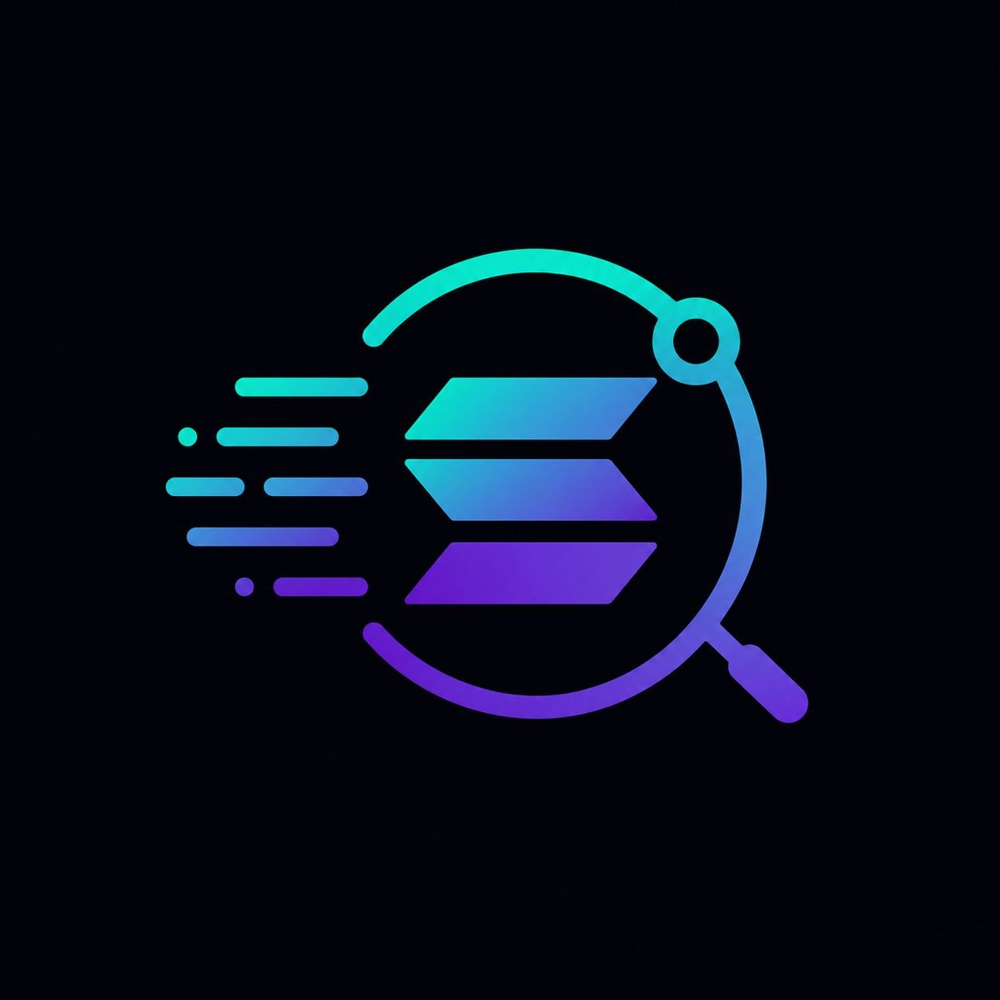
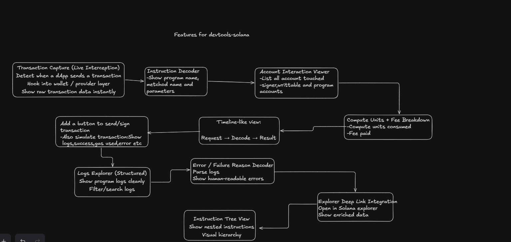

# ChronoTrace Solana

ChronoTrace Solana is the missing observability layer for Solana dApp teams.

Today, developers still debug one transaction across wallet popups, RPC payloads, explorer tabs, and raw logs. That fragmented workflow kills iteration speed and hides root causes. ChronoTrace turns it into one deterministic flow: capture, decode, inspect, explain.

## Why This Is Necessary (And Missing)

Solana has world-class execution speed, but not world-class execution visibility.

When a transaction fails, developers still ask basic questions manually:

- What exactly was sent from the dApp?
- Which accounts were touched, and how?
- Where did execution fail?
- Was the failure due to params, account state, or compute budget?
- How much compute and fee did this call consume?

ChronoTrace Solana answers these instantly in one place, during development, in DevTools context.

If Solana wants faster shipping cycles, fewer silent failures, and better UX in production dApps, this visibility layer is mandatory. We are building the equivalent of APM for on-chain transaction execution.



## Core Capabilities

- Live transaction interception
  - Hooks wallet/provider/connection calls at runtime
  - Captures request and response payloads immediately

- Multi-method wallet and RPC coverage
  - Tracks send/sign/signMessage/simulate flows plus common read/write RPC calls
  - Preserves method-specific context so each trace stays semantically accurate

- Mock simulation / real simulation trigger visibility
  - Differentiates real chain simulation paths from mocked/local simulation flows
  - Captures trigger source and request shape to speed up reproduce-and-fix loops

- Instruction and parameter decoding
  - Shows method-level and instruction-level intent
  - Decodes common Solana programs (System, SPL Token, Token-2022, ATA, Compute Budget, Memo) plus Anchor hints

- Instruction tree view
  - Displays nested instructions/CPI hierarchy with parent-child relationships
  - Helps identify where a deep instruction path failed inside complex transactions

- Raw payload and decoded view side-by-side
  - Keeps original payloads for low-level verification
  - Surfaces interpreted values for fast human understanding

- Account interaction visibility
  - Lists touched accounts with signer/writable/program roles
  - Identifies fee payer and account role in transaction context
  - Surfaces metadata like executable flag, owner program, lamports, rent epoch, and data size

- Account storage inspection
  - Fetches account data in batches for transaction-relevant accounts
  - Applies binary heuristics to reveal meaningful fields beyond base64 blobs
  - Helps distinguish account behavior (program/account/data holder) with human-readable hints

- Error and log intelligence
  - Parses structured logs
  - Surfaces human-readable failure clues from program output

- Failure-aware trace capture
  - Stores successful and failed outcomes in the same causal timeline
  - Makes it easier to pinpoint the exact stage where execution diverged

- Compute and fee analysis
  - Shows compute units and fee impact per flow
  - Helps identify cost/performance regressions early

- Signature and confirmation tracking
  - Extracts transaction signatures from captured flows
  - Polls status to map pending -> confirmed lifecycle transitions

- Timeline and lifecycle view
  - Request -> wallet -> pending -> confirmed -> explorer
  - Makes latency and stage-level failures visible at a glance

- Session persistence and reset controls
  - Persists captured events in extension storage for stable debugging sessions
  - Supports explicit event clearing to start clean during iterative testing

- Multi-surface extension UX
  - Works with DevTools panel and side panel experiences
  - Keeps trace updates synchronized across extension surfaces

- Explorer deep-link verification
  - One-click compare between local decoded context and on-chain explorer view

## Architecture (High Level)

- In-page hook layer
  - Wraps wallet/provider/connection methods in the page runtime
  - Emits structured BEFORE/AFTER/INFO events with call IDs, arguments, and timing data
  - Captures both successful responses and failure payloads for the same call path
  - File: extension/src/inpage.js

- Extension transport layer
  - Receives in-page events through content script bridge
  - Forwards events to background service worker for persistence
  - Stores and rebroadcasts updates so DevTools/side panel stay in sync
  - Files: extension/src/content.js, extension/src/background.js

- Trace intelligence layer
  - Groups event streams into trace sessions using call identity
  - Normalizes payload shape for send/sign/simulate and RPC call variants
  - Decodes instruction data and extracts signatures/account hints
  - Enriches traces with transaction status, logs, fee, compute, and account context
  - Files: extension/src/components/traceUtils.js, extension/src/components/TracePanel.jsx

- Inspector UI layer
  - Renders timeline, decode, account context, logs, and failure analysis in one view
  - Uses lifecycle stages to make transaction progression and latency obvious
  - Supports raw and interpreted views for fast triage plus deep debugging
  - File: extension/src/components/TraceDetail.jsx

## How It Works (End-to-End)

1. Intercept
   - A dApp calls wallet/provider/connection methods (for example send/sign/simulate).
   - ChronoTrace captures the request immediately in-page with a unique call ID.

2. Bridge
   - Captured events move from page context -> content script -> background worker.
   - Events are persisted and broadcast to extension UIs in near real-time.

3. Build Trace
   - The panel groups related BEFORE/AFTER/INFO events into one transaction story.
   - It aligns call timing, method names, payloads, and returned signatures.

4. Decode + Enrich
   - Instruction bytes and parameters are decoded into readable intent.
   - RPC enrichment fetches status, logs, fee/compute usage, and account metadata/state context.

5. Explain
   - UI presents a deterministic flow: request -> chain progress -> outcome.
   - Developers can answer root-cause questions without jumping across multiple tools.


## More To Come
1.Shareable trace links — upload to a lightweight backend and generate a permalink, similar to how Hardhat/Tenderly does it for EVM.


2. Performance & Cost Intelligence
- Compute unit optimizer — compare actual CU consumed vs the budget set, and suggest a tighter setComputeUnitLimit value. Saves fees, improves landing rate.

- Fee history overlay — show priority fee vs current network percentiles so devs can see if they're under/overpaying at send time.

- CPI cost breakdown — attribute compute usage per inner instruction, not just the transaction total.

```
The CU consumed lives directly in the RPC response logs — Solana emits "consumed X of Y compute units" as a program log line. You're already parsing logs in traceUtils.js, so this is a regex extraction. The budget comes from decoding the ComputeBudgetProgram.setComputeUnitLimit instruction, which you already decode. The recommendation formula is simply floor(consumed × 1.1) + 1000 — 10% safety headroom plus a fixed 1000 CU floor to avoid landing failures on jitter. Show three numbers inline in the trace header: budget set, actual consumed, suggested. Add a one-click "Copy fix" that inserts the correct setComputeUnitLimit(N) call.

Feature 3: Fee History Overlay
  ::view-transition-group(*),
  ::view-transition-old(*),
  ::view-transition-new(*) {
    animation-duration: 0.25s;
    animation-timing-function: cubic-bezier(0.19, 1, 0.22, 1);
  }
VvisualizeVvisualize show_widgetCall getRecentPrioritizationFees (RPC method) immediately after you capture the BEFORE event for a transaction — at that point you have the slot context. Store the 150-slot fee sample alongside the trace, compute p25/p50/p75/p90 client-side in traceUtils.js, and compare the setComputeUnitPrice IX decoded from the transaction. Cache results for 5 seconds keyed by slot range so you don't hammer the RPC on rapid retries. The UI renders a simple horizontal gauge — a tick marks where the dev's fee lands relative to the four percentile bands.

Feature 4: CPI Cost Breakdown
This is the most architecturally interesting one. Solana's transaction logs contain invoke [N] depth markers that already encode the CPI hierarchy. The consumed CU for each invoke appears at success or failed lines immediately after. Your existing log parser in traceUtils.js already reconstructs the instruction tree — the CPI cost breakdown is purely an extension of that parser.
The approach: parse the log stream into a stack. Each Program X invoke [N] pushes a frame. Each Program X consumed Y of Z pops it and records the delta. The key insight is that the top-level consumed is the total, and each inner consumed line represents just that CPI's own work. So CPI cost = frame.consumed - sum(children.consumed). This gives you a true attribution tree — you can show a treemap or indented list in TraceDetail.jsx where each row is a program and its isolated CU cost, not the cumulative total.
No new RPC calls needed — it's all in the logs you already fetch.
```
3. dApp-side SDK — a lightweight JS package teams embed in production to capture real-user transaction failures and pipe them to a dashboard. This is the Sentry equivalent and the natural monetization path.